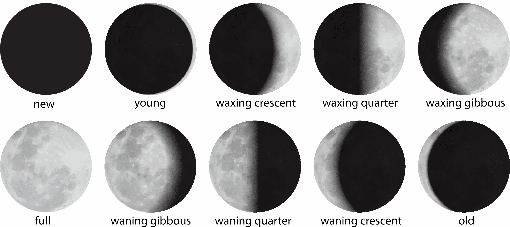

# Fase lunar
```{r echo=FALSE}
load("data_processed/datos_procesados.RData")
```

Se necesita tener la fase lunar de cada registro, quizás lo óptimo sería analizar solo los registros nocturnos, pero en esta oportunidad agregaré este dato a todos los registros. Para obtener este dato se utilizará el paquete suncalc.

```{r eval=FALSE}
library(suncalc)
```

Cuando se aplica la función `getMoonIllumination` se obtienen los siguientes datos.

```{r}
getMoonIllumination(date = Sys.Date())
```

Donde:

- 0: Luna Nueva
- Luna Creciente
- 0.25: Cuarto Creciente
- Luna Gibosa Creciente
- 0.5: Luna Llena
- Luna Gibosa Menguante
- 0.75: Cuarto Menguante
- Luna Menguante

<p align="center">

</p>


## Preparación de datos

Me parece que el análisis que incluye las fases lunares deben hacerse solo con los registros nocturnos y crepusculares. Por lo que primero se establecen que registros caen dentro de estas categorías. Siendo \(\frac{\pi}{2}\) el amanecer y \(\frac{3\pi}{2}\) el atardecer.

```{r}
data_nocturnal <- data %>% 
  mutate(nocturnal = ifelse(solar < pi/2 | solar > 3 * pi/2, 1, 0))
```

Con el código de arriba se puede clasificar fácilmente entre registros nocturnos y diurnos. Utilizando como ejemplo a _L. gymnocercus_ y se grafican los registros nocturnos se tiene:

```{r, out.width="100%"}
circular_data <- circular(data_nocturnal %>% filter(sp == "Lgym" & nocturnal == 1) %>% select(solar),
                rotation = "counter",
                template = "clock24")
# 00, 12, 18, 6
plot(circular_data,
     stack = TRUE,
     col = "#698B22",
     start.sep=0.05,
     sep = 0.01,
     bins = 128,
     ticks = TRUE,
     tol = 0.2,
     cex = .7,
     main = "Registros nocturnos de L. gymnocercus en horario solar")
```

## Fase lunar de cada registro

```{r}
data_nocturnal <- data_nocturnal %>% 
  mutate(moon_phase = getMoonIllumination(date = as_date(datetime))$phase)
```

```{r echo = FALSE}
paged_table(head(data_nocturnal))
```

Y por último se ajustan los valores de las fases lunares a radianes.

```{r}
data_nocturnal <- data_nocturnal %>% 
  mutate(moon_phase = 2 * pi * moon_phase)
```


```{r eval=FALSE, echo=FALSE}
data <- data_nocturnal
save(data, file = "data_processed/datos_procesados.RData")
```

## Kernels utilizando fase lunar

También se puede ajustar funciones de densidad kernel no paramétricas utilizando el paquete de R overlap.

```{r}
tmp1 <- data %>% 
  filter(sp == "Aaxi")

tmp2 <- data %>% 
  filter(sp == "Mgou")
```

Para el primer caso:

```{r}
densityPlot(tmp1$moon_phase,
            extend = 'lightgrey',
            lwd=3,
            xaxt = "n",
            xscale=NA,
            xlab = "Moon phase",
            main = paste(tmp1$sp[1], "y", tmp2$sp[1]),
            col = "#1982c4"
            )
axis(1, at = seq(0, 2 * pi, pi /2), labels = FALSE)
mtext(side = 1, at = seq(0, 2 * pi, pi /2), text = c("🌑\nNew Moon", "🌓\nFirst Quarter", "🌕\nFull Moon", "🌗\nLast Quarter", "🌑\nNew Moon"), padj = 1)
```

Y para el segundo:

```{r}
densityPlot(tmp2$moon_phase,
            extend = 'lightgrey',
            lwd=3,
            xaxt = "n",
            xscale=NA,
            xlab = "Moon phase",
            col = "#8ac926")
axis(1, at = seq(0, 2 * pi, pi /2), labels = FALSE)
mtext(side = 1, at = seq(0, 2 * pi, pi /2), text = c("🌑\nNew Moon", "🌓\nFirst Quarter", "🌕\nFull Moon", "🌗\nLast Quarter", "🌑\nNew Moon"), padj = 1)
```

También se puede hacer un overlap:

```{r}
overlapPlot(tmp1$moon_phase,
            tmp2$moon_phase,
            xscale=NA,
            linewidth = c(2,2),
            linecol = c("#8ac926", "#1982c4"),
            xaxt = "n",
            main = paste("Overlap", tmp1$sp[1], "y", tmp2$sp[1]),
            xlab = "Moon phase",
            extend = 'white')
mtext(side = 1, at = seq(0, 2 * pi, pi /2), text = c("🌑\nNew Moon", "🌓\nFirst Quarter", "🌕\nFull Moon", "🌗\nLast Quarter", "🌑\nNew Moon"), padj = 1)
abline(v=c(0, 2*pi), lty=3)
```

Y se obtienen los valores de estimación de overlap, demostrando una alta superposición en las curvas de densidad y por lo tanto, una mayor similitud en su actividad.

```{r}
overlapEst(tmp1$moon_phase,tmp2$moon_phase)
```

## Kernels de Superposición para Pares de Especies

A continuación, se generan gráficos de superposición de fases lunares para los registros nocturnos de todos los pares de especies de interés. En estos graficos se puede ver entre () la cantiad de registros nocturnos para cada especie.

```{r}
species_pairs <- list(c("Ctho", "Lgym"), c("Aaxi", "Mgou"), c("Dnov", "Dsep"), c("Lgeo", "Lwie"))

# Bucle para generar los gráficos
for (pair in species_pairs) {
  # Filtrar los datos para cada especie en el par
  tmp1 <- data[data$sp == pair[1], ]
  tmp2 <- data[data$sp == pair[2], ]
  
  # Contar el número de registros de cada especie
  n1 <- nrow(tmp1)
  n2 <- nrow(tmp2)
  
  # Crear el gráfico de superposición
  overlapPlot(tmp1$moon_phase,
              tmp2$moon_phase,
              xscale=NA,
              linewidth = c(2,2),
              linecol = c("#8ac926", "#1982c4"),
              xaxt = "n",
              main = paste0("Overlap ", pair[1], " (", n1, ")", " y ", pair[2], " (", n2, ")"),
              xlab = "Moon phase",
              extend = 'white')
  
  # Personalizar los ejes y agregar líneas verticales
  mtext(side = 1, at = seq(0, 2 * pi, pi / 2), text = c("🌑\nNew Moon", "🌓\nFirst Quarter", "🌕\nFull Moon", "🌗\nLast Quarter", "🌑\nNew Moon"), padj = 1)
  abline(v = c(0, 2 * pi), lty = 3)
}
```

```{r show=FALSE}
# Para eliminar todas las variables del entorno.
rm(list = ls())
```
