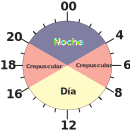

# Modelos para Jenni

Su trabajo se titula "Respuestas espaciales y temporales de Subulo gouazoubira ante la presencia de tres mamíferos introducidos en Uruguay."

> El objetivo del presente estudio fue evaluar el impacto de tres mamíferos introducidos (el jabalí Sus scrofa, el ciervo axis Axis axis y los perros de movimiento libre Canis familiaris) sobre la selección de hábitat y los patrones diarios de actividad del guazubirá (Subulo gouazoubira), en áreas protegidas del este de Uruguay

A tener en cuenta:

- A nivel de cámara y sistema:
  - Tasas de registros de:
    - Jabalí _Sus scrofa_
    - Ciervo _Axis axis_
    - Perros de movimiento libre _Canis familiaris_
  - Cobertura arbórea
- Fase lunar (fracción de luna iluminada)

Estos datos son los que necesito para correr el modelo, en mi tesis de grado no se contempla las tasas de registro de Jabalí ni de Ciervo Axis. Por lo que en primer lugar se obtienen dichos datos.


## Preparación de datos

En primer lugar obtengo la tasa de registro de ciervo axis y jabalí a nivel de cámara y sistema. Para esto cargo los datos de la planilla general y prosigo.

```{r}
load("data/planilla_general.RData")
data <- datos %>% 
  select(site, system = station, camera, datetime, sp = species)
```

### Tasa de registro

#### A nivel de sistema

```{r}
tr_data <- data %>%
  filter(sp %in% c("Sscr", "Aaxi")) %>% 
  mutate(system = str_sub(camera, 1, 4)) %>% 
  select(system, camera, sp)

# En primer lugar se busca el esfuerzo para cada sistema.
system_effort <- read_rds(file = "data_processed/camera_data.RData") %>% 
  mutate(system = str_sub(camera, 1, 4)) %>%
  select(system, camera, effort) %>%
  group_by(system) %>%
  summarise(effort = sum(effort))

# Esfuerzo de todos los sitemas.
tr_system <- tr_data %>%
  select(system, sp) %>%
  group_by(system, sp) %>%
  summarise(count = n()) %>%
  ungroup()

# Luego se contabiliza la cantidad de registros independientes de cada especie en los sistemas.
tr_system <- tr_system %>%
  left_join(system_effort, by = join_by(system)) %>%
  group_by(system, sp) %>% 
  summarise(tr_system = count/effort)
```

Y se obtiene:

```{r echo=FALSE}
paged_table(head(tr_system))
```

#### A nivel de camara

```{r}
# En primer lugar se carga el esfuerzo para cada camara.
camera_effort <- read_rds(file = "data_processed/camera_data.RData") %>%
  select(camera, effort)

# Se cuenta la cantidad de regitros independientes en cada cámara para la especies de interés.
tr_camera <- tr_data %>%
  select(camera, sp) %>%
  group_by(camera, sp) %>%
  summarise(count = n())

# Se realiza el calculo de la tasa de registro.
tr_camera <- tr_camera %>%
  left_join(camera_effort, by = join_by(camera)) %>%
  group_by(camera, sp) %>% 
  summarise(tr_camera = count/effort) %>% 
  mutate(system = substr(camera, 1, 4))
```

Se unen los datos en una tabla única para mejor organización, en ella existen los valores de la tasa de registro tanto a nivel de sistema como de camara.

```{r}
tr_results <- tr_camera %>% 
  left_join(tr_system, join_by(system, sp)) %>% 
  select(system, camera, sp, tr_system, tr_camera)
```

Y se obtiene:

```{r echo=FALSE}
paged_table(head(tr_results))
```

Por último se añaden estos valores a la tabla general.

```{r}
load("data_processed/datos_procesados_v4.RData")
```


```{r}
# Obtener todas las cámaras con registro de cualquier especie.
all_cameras <- data %>% 
  select(camera) %>% 
  pull()

# Modificar resultados de TR y hacerlos "anchos"
tr <- tr_results %>% 
  pivot_wider(names_from = sp, values_from = c(tr_system, tr_camera), names_sep = "_")

# Verificar qué camaras son las que faltan en el cálculo de la tr, ya que no poseen registros ni de Btau ni de Cfam
missing_cameras <- setdiff(all_cameras, tr$camera)

# Creamos un tibble con estos datos faltantes
missing_tibble <- tibble::tibble(
  system = substr(missing_cameras, 1, 4), 
  camera = missing_cameras,
  tr_system_Aaxi = 0,
  tr_camera_Aaxi = 0,
  tr_system_Sscr = 0,
  tr_camera_Sscr = 0
)

# Y los unimos en un mismo set de datos
tr <- bind_rows(tr, missing_tibble)

# Reemplzamos todos los NA por 0.
tr[is.na(tr)] <- 0

load("data_processed/datos_procesados_v4.RData") # Se carga planilla general

data <- data %>%
  mutate(system = substr(camera, 1, 4)) %>% 
  left_join(tr, join_by(system, camera)) %>% 
  select(site, system, camera, sp, datetime, everything()) %>% 
  rename(tr_aaxi_sys = tr_system_Aaxi,
         tr_aaxi_cam = tr_camera_Aaxi,
         tr_sscr_sys = tr_system_Sscr,
         tr_sscr_cam = tr_camera_Sscr)
```

Por último solo me quedo con los datos de _S. gouazoubira_.

```{r}
data <- data %>% 
  filter(sp == "Mgou")
```

Se tiene un total de 275 registros y en la siguiente gráfica se puede ver la cantidad por cámara.

```{r echo=FALSE}
library(plotly)

p <- ggplot(data=data, aes(x = camera, fill = system, color = site)) +
  geom_bar() +
  ggtitle("Gráfica interactiva: Cantidad de registros en cada camara") +
  theme(legend.position = "none") +
  theme(text = element_text(size = 8), axis.text.x = element_text(angle = 90, hjust = 0))

p_plotly <- ggplotly(p)
p_plotly
```

### Estado de los datos

- <input type="checkbox" checked> Tasa de registro de Perro a nivel de cámara y sistema</input>
- <input type="checkbox" checked> Tasa de registro de Jabalí a nivel de cámara y sistema</input>
- <input type="checkbox" checked> Tasa de registro de Ciervo Axis a nivel de cámara y sistema</input>
- <input type="checkbox" checked> Cobertura arbórea a nivel de cámara y sistema</input>
- <input type="checkbox" checked> Iluminación de luna</input>

La tabla con la que se cuenta luce así:

```{r echo=FALSE}
paged_table(head(data, n = 20))
```

Falta la columna "periodo", donde se especifica en qué categoría diel cae el registro.

<div style="text-align:center;">
  
</div>

```{r}
source("functions/convert_hours.R")
data <- data %>% 
  mutate(solartime_hms = hms(radians_to_hour(solar)),
         periodos = case_when(
           solartime_hms >= hours(20) | solartime_hms <= hours(4) ~ "nocturno",
           solartime_hms > hours(4) & solartime_hms < hours(8) ~ "crepusculo-diurno",
           solartime_hms > hours(16) & solartime_hms < hours(20)  ~ "crepusculo-nocturno",
           solartime_hms >= hours(8) & solartime_hms <= hours(16) ~ "diurno",
         ))


# Grafica para confirmar los periodos.
ggplot(data, aes(x = solar, y = 1, color = periodos)) +  # Usar '1' como eje y solo para dispersión
  geom_point() +
  scale_x_continuous(breaks = seq(0, 2 * pi, by = pi / 2), 
                     labels = c("0", "π/2", "π", "3π/2", "2π")) +  # Etiquetas en radianes
  labs(title = "Horarios Solares en Radianes",
       x = "Hora Solar (radianes)",
       y = "Registro") +  # Etiquetas de los ejes
  theme_minimal() +
  theme(legend.title = element_blank())
```

- $0$: Medianoche
- $\frac{pi}{2}$: Amanecer
- $\pi$: Mediodía
- $\frac{3 \pi}{2}$: Atardecer

Podemos ver también la cantidad de registros dentro de cada periodo:


```{r}
data %>% 
  select(periodos) %>% 
  group_by(periodos) %>% 
  summarise(n = n()) %>% 
  arrange(-n)
```

Por último hay que formatear las columnas.

```{r}
data <- data %>% 
  mutate(system = as.factor(system),
         camera = as.factor(camera),
         periodos = as.factor(periodos))
```


```{r include=FALSE}
data <- data %>% 
  select(system, camera, periodos, moon_ilumination, starts_with("tr_"), wood_cam, wood_sys, n_tech_cam, n_tech_sys)

save(data, file = "data_processed/datos_jenni.RData")

# Para eliminar todas las variables del entorno.
rm(list = ls())
load("data_processed/datos_jenni.RData")
```

## Modelo generalidades

| Atributo           | Descripción                                                               | Tipo                |
|--------------------|---------------------------------------------------------------------------|---------------------|
| system             | Sistema                                                                   | Nominal          |
| camera             | Nombre de la cámara trampa en que se registró esa observación            | Nominal          |
| periodo            | Categoría diel en que se registra (diurno, nocturno, crepuscular-diurno, crepuscular-nocturno) | Ordinal          |
| moon_illumination   | Fracción de luna iluminada                                                | Continuo            |
| tr_btau_sys       | Tasa de registros (tr) de ganado vacuno a nivel de sistema                | Continuo            |
| tr_btau_cam       | Tasa de registros (tr) de ganado vacuno a nivel de cámara                 | Continuo            |
| tr_cfam_sys       | Tasa de registros (tr) de perros a nivel de sistema                       | Continuo            |
| tr_cfam_cam       | Tasa de registros (tr) de perros a nivel de cámara                        | Continuo            |
| tr_sscr_sys       | Tasa de registros (tr) de jabalí a nivel de sistema                      | Continuo            |
| tr_sscr_cam       | Tasa de registros (tr) de jabalí a nivel de cámara                       | Continuo            |
| tr_aaxi_sys       | Tasa de registros (tr) de ciervo Axis a nivel de sistema                 | Continuo            |
| tr_aaxi_cam       | Tasa de registros (tr) de ciervo Axis a nivel de cámara                  | Continuo            |
| wood_sys           | Proporción de bosque a nivel de sistema                                   | Continuo            |
| wood_cam           | Proporción de bosque a nivel de cámara                                    | Continuo            |
| n_tech_sys         | Cantidad de techos a nivel de sistema                                     | Ordinal              |
| n_tech_cam         | Cantidad de techos a nivel de cámara                                      | Ordinal              |


## Modelo utilizando brms

```{r}
library(brms)
```


```{r eval=FALSE}
modelo_aditivo <- brm(
  formula = bf(periodos ~ moon_ilumination +
                 tr_btau_sys + tr_btau_cam +
                 tr_cfam_sys + tr_cfam_cam + 
                 tr_aaxi_sys + tr_aaxi_cam +
                 tr_sscr_sys + tr_sscr_cam +
                 wood_sys + wood_cam +
                 n_tech_sys + n_tech_cam +
                 (1 | system/camera)),  # Efectos mixtos anidados
  data = data,
  family = categorical(refcat = "nocturno"),  # familia multinomial con el nivel de referencia 'nocturno'
  chains = 4,              # número de cadenas
  iter = 12000,             # número de iteraciones
  warmup = 2000,           # número de iteraciones de calentamiento
  control = list(adapt_delta = 0.95), # control para mejorar la convergencia
  cores = 6,
  threads = 12
)

save(modelo_aditivo, file = "./buckup/modelo_aditivo.RData")
```


```{r}
load("./buckup/modelo_aditivo.RData")
summary(modelo_aditivo)
```